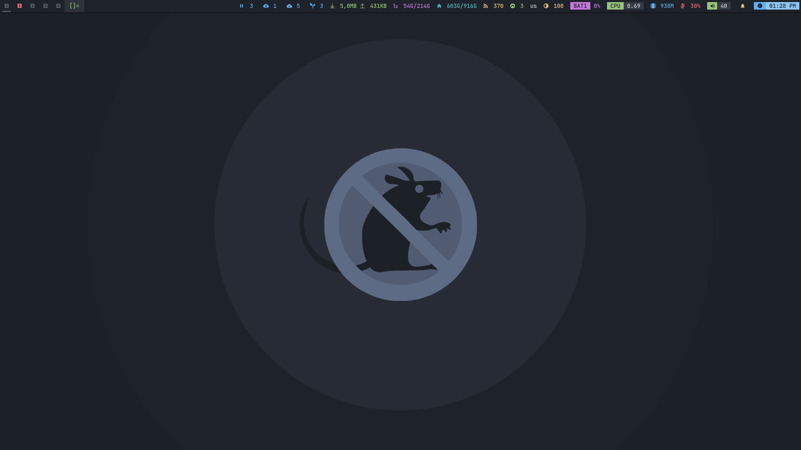
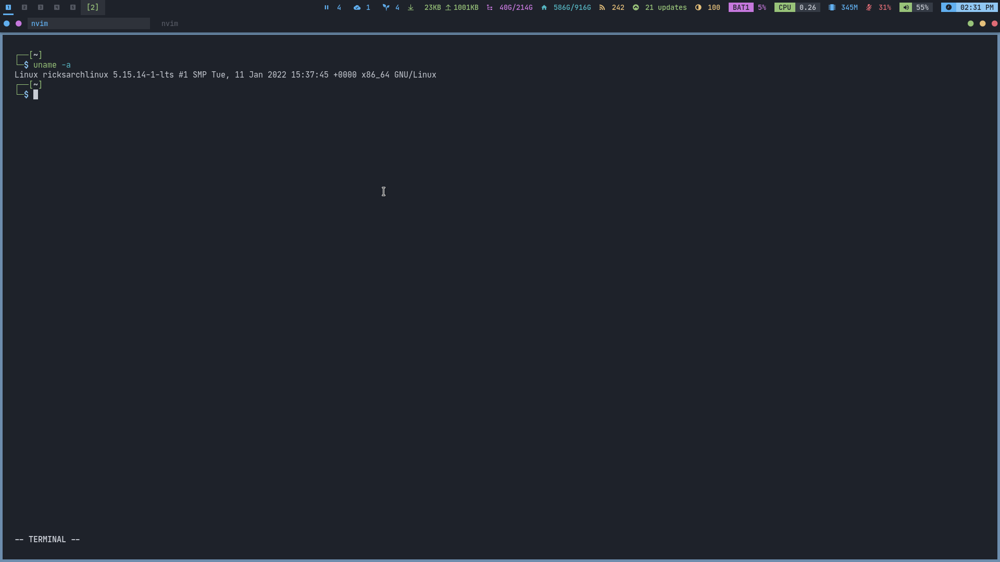
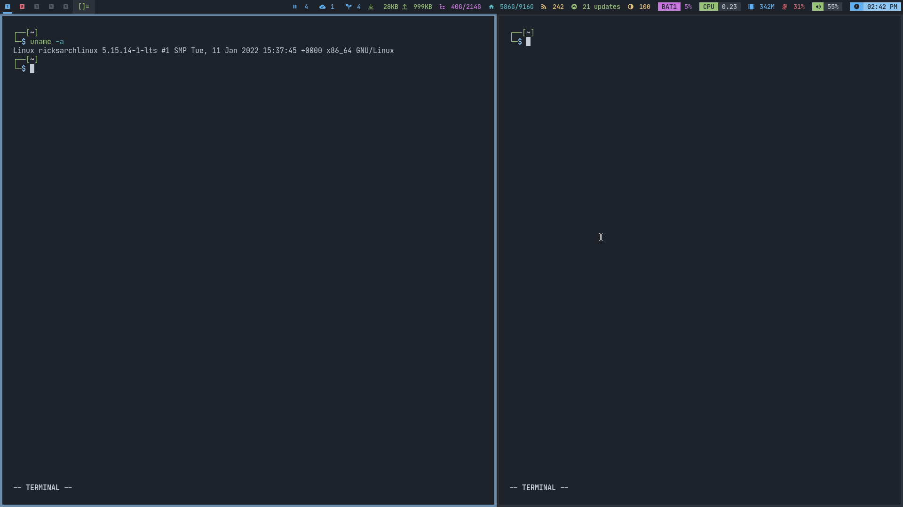

# mouseless
<p align="center">
  
</p>


| Empty workspace preview.      	   	      |
| ---                                                 |
|  |

| The image below shows a monocle layout.      	   | The image below shows a stack layout.            |
| ---                                              | ---					      |
|  |  |

## Installation:
On an Arch-based distribution as root, run the following:
```
curl -LO https://raw.githubusercontent.com/ricksdomein/mouseless/main/INSTALL.sh
sh INSTALL.sh
```
That's it.

## What is mouseless?

mouseless is a script that autoinstalls and autoconfigures a fully-functioning and minimal terminal-and-vim-based Arch Linux environment.

`INSTALL.sh` can be run on a fresh install of Arch or Artix Linux, and provides you with a fully configured diving-board for work or more customization.
